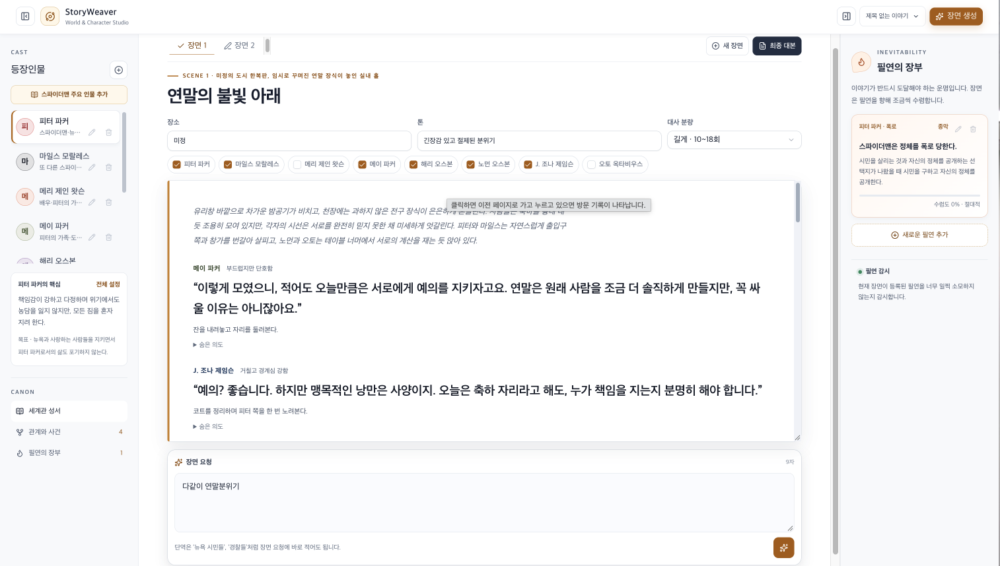
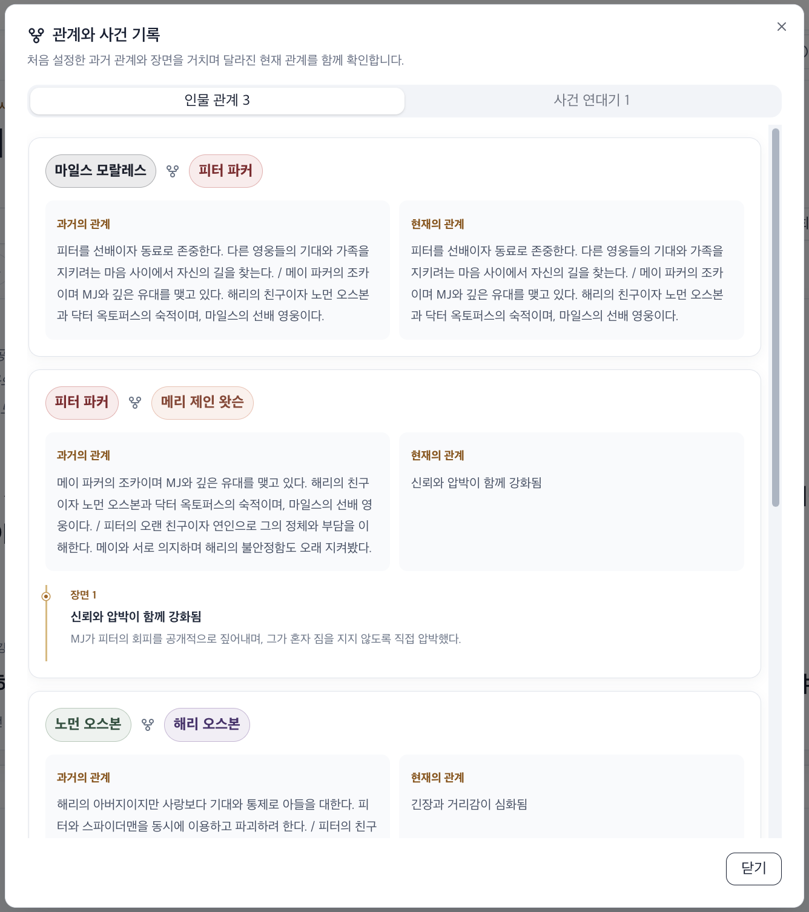
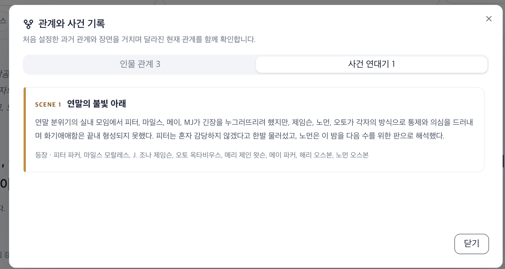
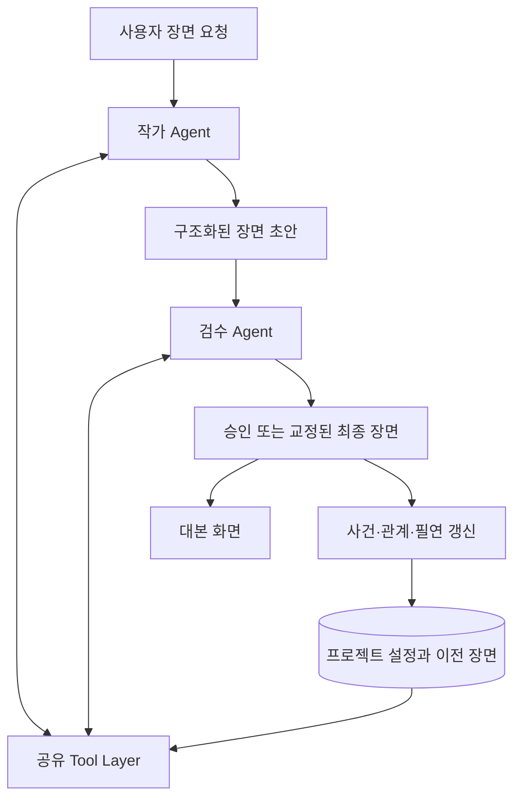

# StoryWeaver

캐릭터, 관계, 세계관, 필연과 이전 장면을 조회해 설정에 맞는 대본을 생성하는 LangChain 기반 창작 워크스페이스입니다. 작가 Agent가 초안을 작성하고 검수 Agent가 같은 설정을 독립적으로 다시 확인한 뒤, 승인되거나 교정된 장면만 다음 이야기의 기억으로 남깁니다.

[라이브 데모](https://storyweaver-ten.vercel.app) · [LangChain 노트북](./StoryWeaver_LangChain.ipynb)

## 화면

### 장면 생성 워크스페이스

캐릭터와 필연을 선택하고 장면을 생성한 뒤, 대본 영역의 높이를 조절하며 결과를 확인할 수 있습니다.



### 인물 관계

처음 설정한 과거 관계와 장면을 거치며 달라진 현재 관계, 변화의 이유를 인물 조합별로 확인할 수 있습니다.



### 관계와 사건 기록

생성된 장면에서 확정된 관계 변화와 핵심 사건을 장면 순서대로 확인할 수 있습니다.



## 프로젝트 배경

연재가 길어질수록 캐릭터의 성격과 말투, 능력의 한계, 관계, 부상과 비밀 같은 정보가 계속 쌓입니다. 새 장면을 쓸 때마다 설정집과 이전 회차를 다시 확인해야 하고, 이 과정이 부족하면 다음과 같은 문제가 생깁니다.

- 캐릭터에 맞지 않는 대사와 행동
- 설정에 없는 능력 사용
- 이전 장면의 감정, 부상과 사건 누락
- 관계 변화와 세계관 규칙의 충돌
- 반복적인 설정 확인과 재작성

StoryWeaver는 누적 설정의 조회, 장면 초안 작성, 독립 검수와 상태 갱신을 하나의 흐름으로 연결해 작가가 플롯과 연출에 집중하도록 돕습니다.

## 주요 기능

- 캐릭터의 성격, 말투, 과거, 목표, 비밀, 기술과 제약 관리
- 시대, 역사, 규칙과 세력으로 구성된 세계관 성서 관리
- 캐릭터별 필연과 성립 조건, 기한, 강제성 및 진행도 관리
- 장소, 분위기, 참여 인물과 대사 분량을 지정한 장면 생성
- 작가 Agent와 검수 Agent의 순차적인 초안 작성 및 설정 검수
- 이전 장면의 대사, 행동, 감정과 숨은 의도를 다음 장면에서 조회
- 확정된 사건과 관계 변화, 필연 진행도를 프로젝트 상태에 반영
- 대사, 행동, 감정, 숨은 의도와 연속성 경고를 구분한 구조화 출력
- 여러 장면을 묶은 최종 대본 보기 및 복사
- 좌우 설정 패널 접기와 대본 영역 높이 조절
- 브라우저 `localStorage`를 이용한 프로젝트 및 장면 저장
- 스파이더맨 주요 인물 8명의 교육용 프리셋 제공
- 실제 역사 기반 작품에서만 한국어 Wikipedia 검색 Tool을 선택적으로 사용

## 처리 구조



| Actor | 역할 |
|---|---|
| 사용자 | 프로젝트 설정을 등록하고 장면의 목표, 참여 인물, 장소, 분위기와 대사 분량을 지정합니다. |
| 작가 Agent | Tool로 원본 설정을 조회하고 구조화된 장면 초안을 작성합니다. |
| 검수 Agent | 같은 Tool을 다시 호출해 초안을 독립적으로 검수하고 승인하거나 직접 교정합니다. |

검수 결과의 `finalScene`만 화면과 프로젝트 상태에 반영됩니다. 장면 2부터는 이전에 완성된 모든 장면을 시간순으로 조회하므로 사건, 인물의 지식, 감정, 부상, 소지품과 약속을 이어갈 수 있습니다.

## LangChain 설계

### Tool Layer

StoryWeaver의 핵심 데이터는 캐릭터 이름, 관계 ID와 장면 번호처럼 조회 기준이 명확합니다. 따라서 현재 구현은 유사 문서를 찾는 Vector Store RAG보다 전체 레코드를 정확히 가져오는 Tool 방식을 사용합니다.

| Tool | 역할 |
|---|---|
| `get_character_profile` | 참여 캐릭터의 성격, 말투, 과거, 트라우마, 목표, 비밀과 기술을 조회합니다. |
| `get_relationship_state` | 인물 사이의 과거·현재 관계, 장면별 변화와 함께 겪은 사건을 조회합니다. |
| `search_world_lore` | 작품의 시대, 역사, 세력, 기술과 세계 규칙을 조회합니다. |
| `get_inevitabilities` | 캐릭터에게 연결된 필연, 조건과 진행도를 조회합니다. |
| `get_previous_scenes` | 현재 장면보다 앞서 완성된 모든 장면을 시간순으로 조회합니다. |
| `search_historical_context` | 역사 모드에서 필요한 경우 한국어 Wikipedia API를 검색합니다. |

Python 노트북에서는 첫 번째 Tool을 `get_character_profiles`라는 이름으로 구현하며 역할은 같습니다.

작품 내부의 세계관 성서는 외부 역사 자료보다 항상 우선합니다. 이름 없는 시민, 경찰과 경비원 같은 단역은 장면 안에서 사용할 수 있지만 프로젝트의 주요 인물이나 장기 관계로 저장하지 않습니다.

### Structured Output

웹앱은 Zod 스키마를, Python 노트북은 Pydantic 모델을 사용해 LLM 응답을 검증합니다. 최종 장면에는 다음 데이터가 포함됩니다.

- 제목, 장소와 장면 설명
- 화자, 대사, 감정, 행동과 숨은 의도
- 설정 일관성 상태, 경고와 참고 사항
- 필연별 진행 변화량과 이유
- 사건 요약과 의미 있는 관계 변화
- 검수 Agent의 승인 또는 교정 결과

이 구조는 자유 형식 대본을 화면 표시, 상태 저장과 다음 장면 조회에 사용할 수 있는 데이터 계약으로 바꿉니다. 형식이 스키마와 맞지 않으면 Agent 실행을 한 번 더 시도하고, 최종 실패 시 사용자용 오류를 반환합니다.

### Middleware와 실행 안정성

두 Agent에는 같은 안정화 계층이 적용됩니다.

- `ModelRetryMiddleware`: 네트워크 오류, 요청 제한과 일시적인 모델 오류를 한 번 자동 재시도합니다.
- 실행 추적 Middleware: Agent별 처리 시간과 모델 호출 횟수를 Tool Trace에 기록합니다.
- 구조화 출력 재검증: 초안 또는 검수 결과가 스키마에 맞지 않으면 해당 Agent를 한 번 더 실행합니다.
- 서버 실행: Vercel Node.js Runtime에서 최대 300초 동안 장면 생성을 처리합니다.

## 웹앱과 노트북

| 구분 | 웹앱 | 노트북 |
|---|---|---|
| 언어 | TypeScript | Python |
| 실행 환경 | Next.js App Router, Vercel | Jupyter Notebook |
| 출력 검증 | Zod | Pydantic |
| 상태 저장 | 브라우저 `localStorage` | 커널 메모리의 `PROJECT`, `SCENES` |
| 목적 | 실제 UI에서 프로젝트와 장면 편집 | LangChain 설계와 2-Agent 흐름 학습 및 시연 |

노트북은 스파이더맨 세계관 예시로 장면 1과 장면 2를 생성하며, 두 번째 장면에서 첫 장면의 부상과 관계 변화를 이어가는 과정을 보여줍니다.

## 기술 스택

- Next.js 16, React 19, TypeScript
- LangChain JS, `@langchain/openai`, `ChatOpenAI`
- Zod Structured Output
- Tailwind CSS 4, shadcn/ui
- Vercel Functions
- Python, LangChain, Pydantic 기반 Jupyter Notebook

## 로컬 실행

### 요구 사항

- Node.js 22.13 이상
- OpenAI API 키

### 설치

```bash
git clone https://github.com/Lineon24/StoryWeaver.git
cd StoryWeaver
npm install
cp .env.example .env.local
```

`.env.local`에 API 키와 사용할 모델을 입력합니다.

```dotenv
OPENAI_API_KEY=your_openai_api_key
STORYWEAVER_MODEL=gpt-5.4-mini
```

개발 서버를 실행합니다.

```bash
npm run dev
```

브라우저에서 [http://localhost:5173](http://localhost:5173)을 엽니다.

### 주요 명령어

| 명령어 | 설명 |
|---|---|
| `npm run dev` | Vinext 기반 로컬 개발 서버를 실행합니다. |
| `npm run build` | Vercel 배포용 Next.js 프로덕션 빌드를 생성합니다. |
| `npm run build:vinext` | Vinext/Cloudflare용 빌드를 생성합니다. |
| `npm run lint` | ESLint 검사를 실행합니다. |

## 사용 방법

1. 세계관 성서에서 작품의 시대, 역사, 규칙과 세력을 입력합니다.
2. 캐릭터를 추가하고 성격, 말투, 목표, 비밀과 기술의 범위를 설정합니다.
3. 필요한 경우 캐릭터에게 필연과 성립 조건을 등록합니다.
4. 장면에 참여할 인물을 선택하고 장소, 분위기와 대사 분량을 정합니다.
5. 장면 요청에 반드시 일어나야 할 상황을 적고 `장면 생성`을 누릅니다.
6. 생성된 대본과 관계·사건 기록, 필연 진행도를 확인합니다.
7. 새 장면을 추가하면 앞선 장면의 사건과 관계가 자동으로 다음 생성에 전달됩니다.

프로젝트와 장면은 현재 브라우저에 저장됩니다. 브라우저 데이터를 삭제하거나 다른 기기에서 접속하면 자동으로 동기화되지 않습니다.

## Vercel 배포

이 저장소는 `vercel.json`에서 Next.js 프레임워크와 `npm run build`를 사용하도록 설정되어 있습니다. Vercel 프로젝트의 환경 변수에 다음 값을 추가한 뒤 다시 배포합니다.

```text
OPENAI_API_KEY
STORYWEAVER_MODEL
```

Vercel의 Output Directory는 별도로 지정하지 않습니다. Next.js가 기본 `.next` 디렉터리를 생성하고 Vercel이 이를 자동으로 인식합니다.

## 프로젝트 구조

```text
app/
├── api/generate/route.ts   # LangChain Agent, Tool, Middleware와 생성 API
├── globals.css             # 워크스페이스 레이아웃과 반응형 스타일
└── page.tsx                # 프로젝트·장면 편집 UI와 브라우저 상태 관리
lib/
├── spider-man-preset.ts    # 교육용 캐릭터 프리셋
└── story-types.ts          # 프로젝트와 장면 타입 및 초기 상태
StoryWeaver_LangChain.ipynb # Python 기반 LangChain 학습·시연 노트북
```

## 향후 개선

- 데이터베이스를 연결해 프로젝트와 장면을 계정 단위로 영구 저장
- 같은 장면을 재생성할 때 기존 필연 진행도까지 되돌리는 완전한 멱등성 지원
- 장편 설정집과 소설 원문을 위한 Embedding 및 Retriever 기반 RAG 결합
- Agent별 토큰 사용량, 비용, 응답 시간과 재시도 원인 관찰
- 관계와 필연 변화가 저장되기 전에 사용자가 확인하거나 수정하는 승인 UI
